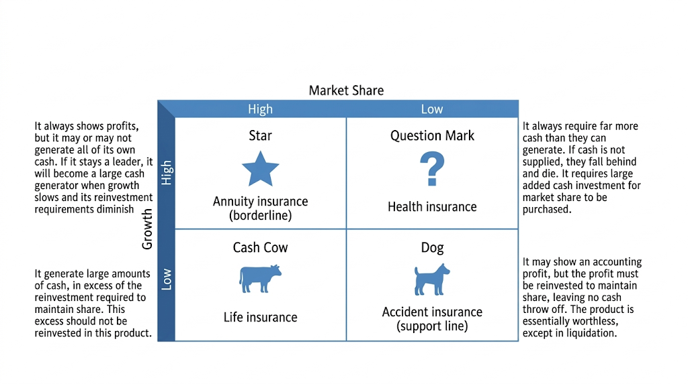

# China Life's Product and Service Portfolio: A Strategic Evaluation through the BCG Matrix and the Ansoff Matrix

Word count (main body, excluding references and appendix): 2100

## 1. Introduction and Methodological Justification

China Life is a portfolio case because of its scale. In 2024, China's insurance industry generated RMB5.7 trillion in premium income and China Life reported gross written premiums of RMB671,457 million and embedded value of RMB1,401,146 million (China Insurance Association, 2025; China Life Insurance Company Limited, 2025a). The issue is reallocation as ageing, pension reform and health demand reshape Chinese life insurance.

The report retains the BCG Matrix and the Ansoff Matrix, but only after narrowing their use. BCG is imperfect in insurance because relative market share and market growth do not map neatly onto value creation: persistence, claims experience, distribution quality and capital intensity also matter, and portfolio value cannot be inferred from product-market position alone (Armstrong & Brodie, 1994; Morrison & Wensley, 1991; Robins & Wiersema, 1995). Yet abandoning BCG entirely would weaken portfolio discipline, so it remains useful if units are defined carefully. This report therefore uses only China Life's four formally disclosed insurance categories as BCG units: life insurance, annuity insurance, health insurance and accident insurance (China Life Insurance Company Limited, 2025a). The senior-care ecosystem is excluded from the BCG matrix and treated instead as a related-diversification platform under Ansoff (1957).

Here, product portfolio refers to the four disclosed insurance lines, while service portfolio refers to senior-care projects, claims and referral processes, digital touchpoints and partner-based care services. Because these elements are not separable share-growth business units, they are analysed under Ansoff related diversification rather than as stand-alone BCG units. Their value lies in improving cross-sell, retention and pricing discipline through claims, referral and customer-data integration.

Classification follows three rules: scale/share proxy through disclosed position and peer comparison; growth proxy through external demand or policy evidence; and profitability/capital discipline as a caveat. Confidence is highest for life insurance, moderate for annuity and health insurance, and lowest for accident insurance. Appendix A summarises the proxy logic.

## 2. BCG Matrix Analysis

Using four disclosed insurance categories creates a cleaner portfolio framework than earlier mixed units, and labels still guide priorities if alternative interpretations are explicit.

Figure 1 visualises the proxy-based BCG positions used below, while Appendix A standardises the evidence behind each classification.

### Life Insurance: Cash Cow

Life insurance is the clearest Cash Cow. China Life remains a leading life insurer, and its scale and embedded value indicate a mature but productive core (China Life Insurance Company Limited, 2025a). Industry data show 8.85% premium growth and 93.47% 13-month persistency in 2023, suggesting a quality-and-efficiency challenge rather than explosive growth (China Insurance Association, 2024). Relative to Ping An and CPIC, China Life's clearest advantage still lies in scale and embedded value rather than service-led monetisation (China Pacific Insurance (Group) Co., Ltd., 2025; Ping An Insurance (Group) Company of China, Ltd., 2025a, 2025b).

An alternative reading would treat life insurance as a low-growth legacy line that deserves little attention. That interpretation is rejected because China Life's relative position and cash-generation remain stronger here than in any other line. The concern is whether cash-generation quality could weaken if interest-rate conditions, regulation or agent productivity deteriorate. Cash Cow should mean disciplined defence, not assumed stability.

### Annuity Insurance: Borderline Star

Annuity insurance is best seen as a borderline Star. China Life states that its third-pillar private pension and commercial annuity insurance businesses ranked first in the industry and that commercial annuity insurance accelerated in 2024 (China Life Insurance Company Limited, 2025a). Late-2024 policy changes confirmed commercial insurance annuities as a core third-pillar category and implemented the personal pension system nationwide, reinforcing retirement-related demand (State Council of the People's Republic of China, 2024a, 2024b; Chen et al., 2023; Cousins, 2025).

An alternative interpretation is that annuity insurance remains a Question Mark because policy tailwinds do not necessarily imply profitable conversion. This is partly persuasive, but it is not adopted because China Life's disclosed first-place position in third-pillar private pension and commercial annuity provides stronger evidence of relative position. Relative to Ping An and CPIC, China Life appears stronger in product-level pension positioning but weaker in full-service retirement monetisation, as rivals report broader retirement-service footprints across multiple cities (China Pacific Insurance (Group) Co., Ltd., 2025; Ping An Insurance (Group) Company of China, Ltd., 2025a, 2025b).

### Health Insurance: Question Mark

Health insurance is best classified as a Question Mark. Commercial health insurance, LTCI-related insurance and supplementary medical protection remain structurally important as China ages and public-private care arrangements deepen (Choi et al., 2018; Cousins, 2025; Yang et al., 2023; Zhu & Bai, 2025). The National Healthcare Security Administration (2026) describes long-term care insurance as moving from pilot exploration to accelerated institutionalisation. In 2024 China Life participated in over 200 supplementary major medical expense programs, 80 long-term care insurance programs and over 130 city-customised commercial medical insurance projects (China Life Insurance Company Limited, 2025a).

A more optimistic interpretation would classify health insurance as an emerging Star. This is rejected at present because programme breadth and policy participation do not yet demonstrate profitable dominance under tighter pricing discipline. Choi et al. (2018) show that the Chinese commercial health insurance market is shaped by claims management, product design and policy conditions as much as by scale. Regulation points in the same direction: a 2025 NFRA notice on city commercial medical insurance stressed precise pricing, commercial sustainability and actuarial discipline rather than growth at any cost (State Council of the People's Republic of China, 2025). Relative to Ping An, China Life's programme participation shows reach, but not yet equivalent monetisation strength, since Ping An reports more than 31 million paying retail customers for health and senior-care services, a stronger paying-customer conversion signal (Ping An Insurance (Group) Company of China, Ltd., 2025a). If underwriting, claims management and digital pricing improve, health insurance could evolve toward Star status; if they do not, growth may create complexity rather than value.

### Accident Insurance: Support Line Closest to Dog

Accident insurance most closely resembles a Dog in BCG terms, but in practice it is better treated as a low-priority support line. China Life still offers it as part of a wider protection portfolio, which gives it value for bundling, cross-selling and inclusion (China Life Insurance Company Limited, 2025a, 2025b). However, there is little evidence of stand-alone growth leadership or clear differentiation relative to life, annuity or health insurance.

An alternative interpretation would treat accident insurance as a neutral support product outside BCG. That view is not adopted because support products still absorb distribution effort, managerial attention and some capital. It should stay in the portfolio mainly for completion and bundling, not for growth investment.

China Life, Ping An and CPIC are not interchangeable peers: China Life is strongest in scale and pension positioning, Ping An in ecosystem monetisation, and CPIC in broadening retirement-service competition. China Life should therefore borrow adjacency logic selectively, not imitate a full ecosystem model (see Appendix D).

## 3. Ansoff Matrix Analysis and Ranked Strategic Choice

The Ansoff Matrix is more useful here as a ranking framework than as four parallel descriptions. Here, market penetration means existing products to existing customers; product development means adapted or new insurance solutions for the existing customer base; market development means extending current capabilities into new customer segments and adjacent demand spaces; and related diversification means moving into service adjacencies beyond the core insurance product. Because Ansoff abstracts from regulation, capital intensity and service-ecosystem execution, it is used here as a strategic ranking framework rather than a mechanical matrix. Appendix B separates the route summary from a weighted decision matrix based on strategic fit, expected return, capability stretch, capital exposure and regulatory dependency.

### 1. Product Development

Product development ranks first because it offers the strongest near-term return with the lowest capability stretch. China Life already upgraded more than 100 products in 2024 (China Life Insurance Company Limited, 2025a). Two priority moves are defensible. The first is a pre-retirement bundle combining commercial annuity accumulation with health or long-term care protection for urban salaried households, sold mainly through bancassurance and certified agents and judged by conversion, retention and claims performance. The second is a top-up health and care-referral offer for existing policyholders, sold through agents and app prompts and judged by cross-sell, persistence and claims turnaround. If claims pressure or capital drag offsets retention gains, the pilot should pause.

### 2. Related Diversification

Related diversification ranks second because the upside is high, but the return horizon is longer and the implementation burden is materially higher. China Life already has 17 institutional elderly-care projects across 14 cities and three senior-care product lines in operation (China Life Insurance Company Limited, 2025a, 2025b). Barney (1991) helps explain why this route is tempting: scale, trust and distribution reach are valuable resources. Markides and Williamson (1994) argue that related diversification creates advantage only when strategically important assets can be transferred across businesses. Day (1994) and Teece (2007) then imply that value depends on integrating claims, service, customer data and partner networks. It ranks below product development because capability stretch, capital exposure and payback uncertainty are higher. China Life's most defensible path is not to copy Ping An's ecosystem model wholesale, but to extend from scale-and-pension strength into selectively integrated service adjacencies. If ecosystem expansion weakens core return metrics, capital should return to product-led growth; if partnership delivery improves service integration without owned asset expansion, that route should dominate.

### 3. Market Development

Market development ranks third because the fit is selective and the likely return is moderate. China Life can broaden reach into pre-retirement households, older customers, community channels, bancassurance-led retirement segments and public-private health schemes. A selective route would target pre-retirement and older urban customers through bancassurance and community channels, but the risk is margin dilution if capabilities do not translate into segment-specific advice. That risk keeps market development below product development.

### 4. Market Penetration

Market penetration ranks fourth because its implementation burden is lowest, but its strategic upside is also lowest. It can improve the Cash Cow through better retention, agent productivity and claims service. Market penetration should therefore focus on higher persistency and cross-sell within the installed base, but it remains a defensive route because it improves core efficiency more than it changes product relevance.

## 4. Strategic Direction, Organisational Learning and Action Priorities

The combined logic of BCG and Ansoff produces a clear recommendation. China Life should defend life insurance as a Cash Cow and funding base; prioritise annuity and health product development; use the senior-care ecosystem as a related-diversification platform; and avoid overcommitting capital to accident insurance beyond its bundling role.

Organisational learning changes strategy selection, not just implementation. China Life faces an exploration-exploitation problem: over-exploiting the mature life core may protect short-run efficiency but weaken future relevance, while over-exploring ecosystem assets may destroy value before the organisation learns how to monetise them. Appendix C turns this logic into governance by specifying owners, baselines, review cycles and go/no-go rules. Learning loops should test whether annuity-health bundles improve retention and conversion, whether claims and service data sharpen pricing discipline, and whether partnership delivery creates value without asset-heavy drag.

In the next 12 months, China Life should treat the life core as a performance engine, cap ecosystem pilot capital, and shift branch and agent scorecards away from premium volume alone toward value of one year's sales, agent productivity, persistence and capital efficiency. Over the same period, it should standardise customer data, claims workflows and service referrals in cities where elderly-care projects already operate. From months 12 to 24, it should pilot bundled propositions combining annuity, health cover and care-related services, while selected agents receive retirement-planning certification and the China Life App integrates claims prompts. From months 24 to 36, rollout should scale only if evidence improves.

Appendix C sets out governance. Core metrics include value of one year's sales, persistence, agent productivity and capital efficiency. Ecosystem pilots are judged by cross-sell ratio, ecosystem-linked new business, elderly retention and claims turnaround time. If core efficiency fails to improve after 12 months, expansionary initiatives should pause; if ecosystem expansion weakens core return metrics, capital should return to product-led growth; and if digital routing and agent incentives conflict, redesign should prioritise whichever side better protects retention and value of new business.

## 5. Conclusion

In BCG terms, life insurance is the clearest Cash Cow, annuity insurance is best seen as a borderline Star, health insurance is a Question Mark, and accident insurance is closest to Dog but retained mainly as a support line. The senior-care ecosystem should not be treated as a separate BCG unit, but as a related-diversification platform under Ansoff.

China Life should prioritise annuity and health product development now; invest in senior-care diversification selectively and on a partnership-led basis; defend but not overfund the mature life core; and avoid treating accident insurance as an independent growth engine.

## References

Ansoff, H. I. (1957). *Strategies for diversification*. *Harvard Business Review, 35*(5), 113-124.

Armstrong, J. S., & Brodie, R. J. (1994). Effects of portfolio planning methods on decision making: Experimental results. *International Journal of Research in Marketing, 11*(1), 73-84. https://doi.org/10.1016/0167-8116(94)90035-3

Barney, J. (1991). Firm resources and sustained competitive advantage. *Journal of Management, 17*(1), 99-120. https://doi.org/10.1177/014920639101700108

Chen, S., Li, L., Jiao, L., & Wang, C. (2023). Long-term care insurance and the future of healthy aging in China. *Nature Aging, 3*(12), 1465-1468. https://doi.org/10.1038/s43587-023-00540-9

China Insurance Association. (2024, December 31). Interpretation of 2023 operating data of legal-entity insurance companies. https://www.iachina.cn/art/2024/12/31/art_22_108139.html

China Insurance Association. (2025, April 27). China Insurance Association releases the top ten events of China's insurance industry in 2024. https://www.iachina.cn/art/2025/4/27/art_22_108350.html

China Life Insurance Company Limited. (2025a, April 23). *Annual report 2024*. https://www1.hkexnews.hk/listedco/listconews/sehk/2025/0423/2025042300417.pdf

China Life Insurance Company Limited. (2025b, March 26). *2024 ESG & social responsibility report*. https://www.e-chinalife.com/upload/resources/file/2025/03/26/1.pdf

China Pacific Insurance (Group) Co., Ltd. (2025, April 22). *2024 annual report*. https://www.cpic.com.cn/upload/resources/file/2025/04/22/86279.pdf

Choi, W. I., Shi, H., Bian, Y., & Hu, H. (2018). Development of commercial health insurance in China: A systematic literature review. *BioMed Research International, 2018*, Article 3163746. https://doi.org/10.1155/2018/3163746

Cousins, M. (2025). Developing long-term care insurance in China: A review of structure, impact and future directions. *International Social Security Review, 78*(1), 83-103. https://doi.org/10.1111/issr.12383

Day, G. S. (1994). The capabilities of market-driven organizations. *Journal of Marketing, 58*(4), 37-52. https://doi.org/10.1177/002224299405800404

March, J. G. (1991). Exploration and exploitation in organizational learning. *Organization Science, 2*(1), 71-87. https://doi.org/10.1287/orsc.2.1.71

Markides, C. C., & Williamson, P. J. (1994). Related diversification, core competences and corporate performance. *Strategic Management Journal, 15*(S2), 149-165. https://doi.org/10.1002/smj.4250151010

Morrison, A., & Wensley, R. (1991). Boxing up or boxed in? A short history of the Boston Consulting Group share/growth matrix. *Journal of Marketing Management, 7*(2), 105-129. https://doi.org/10.1080/0267257X.1991.9964145

National Healthcare Security Administration. (2026, March 30). Accelerating the establishment of the long-term care insurance system. https://www.nhsa.gov.cn/art/2026/3/30/art_14_20061.html

Ping An Insurance (Group) Company of China, Ltd. (2025a, March 19). *Annual report 2024*. https://group.pingan.com/resource/pingan/IR-Docs/2025/pingan-ar24-report.pdf

Ping An Insurance (Group) Company of China, Ltd. (2025b, April 7). Ping An releases 2024 sustainability report. https://group.pingan.com/media/news/2025/pingan-releases-2024-sustainability-report.html

Robins, J. A., & Wiersema, M. F. (1995). A resource-based approach to the multibusiness firm: Empirical analysis of portfolio interrelationships and corporate financial performance. *Strategic Management Journal, 16*(4), 277-299. https://doi.org/10.1002/smj.4250160403

State Council of the People's Republic of China. (2024a, October 14). Commercial insurance annuities meet diverse protection needs. https://www.gov.cn/zhengce/202410/content_6979770.htm

State Council of the People's Republic of China. (2024b, December 13). Personal pension system implemented nationwide. https://www.gov.cn/lianbo/bumen/202412/content_6992312.htm

State Council of the People's Republic of China. (2025, July 31). NFRA requires city commercial medical insurance to follow commercial discipline and precise pricing. https://www.gov.cn/lianbo/bumen/202507/content_7034687.htm

Teece, D. J. (2007). Explicating dynamic capabilities: The nature and microfoundations of (sustainable) enterprise performance. *Strategic Management Journal, 28*(13), 1319-1350. https://doi.org/10.1002/smj.640

Yang, S., Guo, D., Bi, S., & Chen, Y. (2023). The effect of long-term care insurance on healthcare utilization of middle-aged and older adults: Evidence from China Health and Retirement Longitudinal Study. *International Journal for Equity in Health, 22*, Article 228. https://doi.org/10.1186/s12939-023-02042-x

Zhu, Z., & Bai, C. (2025). Assessing the role of long-term care insurance in shaping living arrangements of older adults: Evidence from China. *Health Policy and Planning, 40*(6), 641-651. https://doi.org/10.1093/heapol/czaf027

## Appendix A. BCG Classification Evidence

| Business line | Relative position evidence | Market-growth evidence | Profitability / capital caveat | Final classification |
| --- | --- | --- | --- | --- |
| Life insurance | China Life retains the strongest scale and embedded-value position among the compared firms | Mature line; industry evidence points to quality and persistency rather than high structural growth | Cash generation remains strong, but sensitivity to rates and agent productivity means defence is required | Cash Cow |
| Annuity insurance | China Life reports first-place positioning in third-pillar private pension and commercial annuity business | Strong tailwinds from ageing, pension reform and nationwide personal pension implementation | Conversion quality and monetisation are less certain than product-level position | Borderline Star |
| Health insurance | China Life participates broadly in supplementary medical, LTCI and city-customised health programmes | Strong demand growth, but economics remain uncertain under tighter pricing discipline | Breadth does not yet prove profitable dominance or superior monetisation | Question Mark |
| Accident insurance | Limited stand-alone differentiation relative to other lines; retained mainly for bundling support | Weakest structural growth signal among the four lines | Low strategic payoff as a stand-alone investment line | Closest to Dog / retained for support |

## Appendix B. Ansoff Ranking

### B1. Route Summary

| Ansoff option | Matrix logic | Why it matters for China Life | Final priority |
| --- | --- | --- | --- |
| Product development | New or adapted insurance products for the existing customer base | Favoured because the main gap is relevance within an already extensive customer base | 1 |
| Related diversification | Service adjacency beyond the core insurance offering | Offers higher long-term upside, but also the highest capability and capital stretch | 2 |
| Market development | Existing capabilities into new customer segments and adjacent demand spaces | Useful, but constrained by China's already broad national insurance presence | 3 |
| Market penetration | Existing products to existing customers | Necessary for core defence, but weakest transformative upside | 4 |

### B2. Weighted Decision Matrix

| Criterion | Weight | Product development | Related diversification | Market development | Market penetration |
| --- | --- | --- | --- | --- | --- |
| Strategic fit | 0.30 | High | High | Moderate | Moderate |
| Expected return | 0.25 | High | Moderate-High | Moderate | Low-Moderate |
| Capability stretch | 0.15 | Low-Moderate | High | Moderate | Low |
| Capital exposure | 0.20 | Moderate | High | Moderate | Low |
| Regulatory dependency | 0.10 | Moderate | High | Moderate | Low |
| Overall implication |  | Strongest near-term case | High upside but slower and riskier | Selective extension only | Necessary but mainly defensive |

## Appendix C. Action Governance Framework

| Initiative | Owner | Baseline / comparator | Review cycle | Go / no-go rule |
| --- | --- | --- | --- | --- |
| Pre-retirement annuity-health bundle | Product, actuarial and bancassurance teams | 2024 conversion, retention and claims performance in comparable retirement products | Quarterly pilot review | Scale only if conversion and retention improve without claims pressure eroding capital efficiency |
| Top-up health and care-referral offer | Product, claims and digital teams | 2024 cross-sell, persistency and claims turnaround for existing policyholders | Quarterly pilot review | Continue only if cross-sell and persistency improve together and claims turnaround does not deteriorate |
| Senior-care ecosystem pilot | Dedicated ecosystem office with finance oversight | 2024 ecosystem-linked new business, elderly retention and pilot-city operating evidence | Half-yearly review | Pause if ecosystem expansion weakens core return metrics; prefer partnership delivery if it improves outcomes without owned-asset expansion |
| Life-core performance engine | Sales reform, finance and branch management | 2024 value of one year's sales, persistence, agent productivity and capital efficiency | Half-yearly review | Expansionary initiatives pause if core efficiency does not improve after two review cycles |

## Appendix D. Competitor Model Transferability

| Company | Core advantage | Health / retirement strength | Strategic implication for China Life |
| --- | --- | --- | --- |
| China Life | Scale, embedded value, pension positioning | Stronger at product-level retirement positioning than at full ecosystem monetisation | Defend the core and extend selectively from insurance strength |
| Ping An | Ecosystem integration and monetisation capability | Deeper health and senior-care service integration | Useful reference for service adjacency, but not a full model to copy |
| CPIC | Broadening retirement-service footprint | Shows that retirement-service competition is widening beyond a single rival | Confirms China Life needs a response, but not wholesale imitation |

